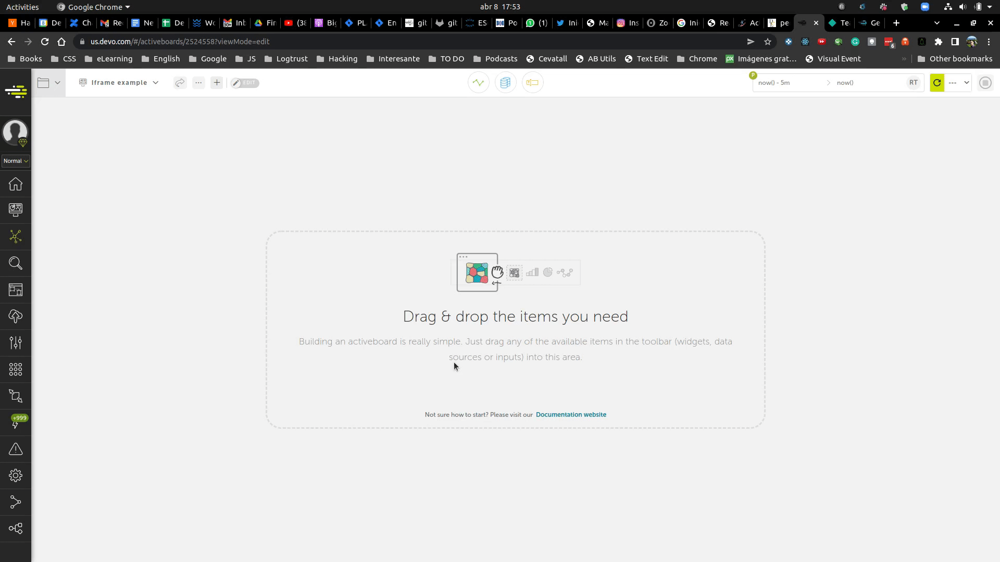

# Description

This project allow you to test your Iframe chart inside Devo before deploying it into production.

First of all,what's an Iframe chart?

Inside Devo Activeboards we have several types of charts: line, column, pie... and there's one that is hidden because it's something experimental.

Since it's hidden, how can we create one?

- Drag and drop any chart to the Activeboard Workspace.
- Open "Raw config" panel and find the chart inside the JSON.
- Change chart subtype to `Iframe`.



Now you can change chart properties like the URL.

The URL is the URL of the Iframe. The content of the URL will be displayed inside the chart.

But that's not all, we can send Devo from data to our Iframe. Cool, right?

This means we could have our own charts library and display our Devo data within Activeboards.

# How to create an Iframed chart

In this project you can find an example of an Iframed chart.

To see this live working, first you have to install the dependencies and then run the project. Open the command line, make sure you have NodeJS installed and run these commands.

## Installation

`npm ci`

## Run the project

`npm start`

You will see something like this:


## Project structure

Inside the root folder you will find an `index.html` file that is the container which mocks the data sent to our Iframed chart.

The logic that sends the data to our Iframe chart is inside `js/container.js`.

You can change the data in `js/mockedData.js`.

Inside the `iframe` folder, you will find all the code related to the Iframed chart.

There's an `iframe/index.html` file and also 3 JS files under `iframe/js` folder.

- `iframe/js/iframe.js`: Contains the logic that receives the data from "Devo" and instantiates our chart.
- `iframe/js/dataFormatter.js`: Converts the Devo data into the format the chart library is able to read.
- `iframe/js/chart.js`: Creates the chart given a data.

This is a basic example where we take for granted we are going to receive an Array of keys and the last element is the value.

The data used in the example is like this:

```
[
    [200,"GET","/","http://www.bing.com/","58.14.227.52",1],
    ....
]
```

Explanation of the elements of the array:
- 1: Is the network response code.
- 2: Is the network request method.
- 3: Is the URL.
- 4: Is the customer IP Address
- 5: Is the number of times this happened (count).

You can build here any chart you want. Just take into account that we are receiving the data coming from Devo in `iframe/js/iframe.js` in this small piece of code:

```js
window.addEventListener("message", (e) => {
  const container = document.getElementById("container");
  container.innerHTML = '';
  const domNode = chart(dataFortmatter(e.data.data), container.clientWidth);
  container.appendChild(domNode);
});
```

The data is inside the object `e.data`. The shape of the object is:

```js
{
  data: [...],
  metadata: [...],
  from: number,
  to: number
}
```

# Deploy it

In this example I'm deploying it inside https://app.netlify.com/

It's pretty simple. Once you create an account, follow these steps:


Right after that you will have your server URL where the Iframe html is located.

Now you will be ready to use it!


